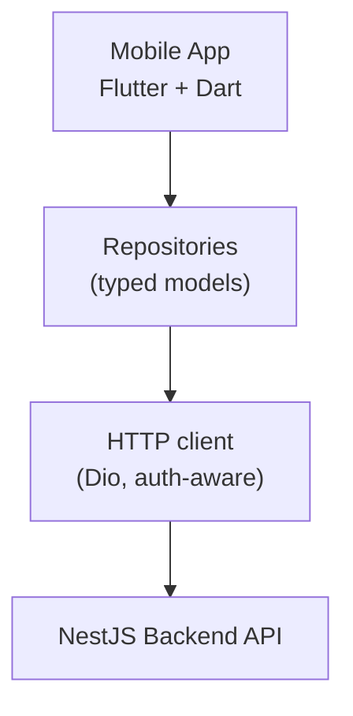
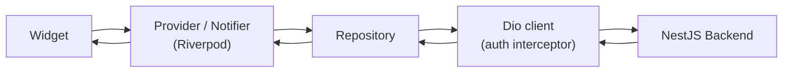

# Mobile Architecture (Flutter)

## How to read this doc

This document describes how the **mobile app** of the school ERP is organized - the parent and student apps, focused on viewing (attendance, fees, results) and light actions (leave requests, payments). The app is built with **Flutter** in **Dart**, shipping to Android and iOS from one codebase. For every concept you'll find three things:

- **What it is** - a plain-English definition.
- **Why it matters here** - the real school problem it solves.
- **Example** - a concrete case using students, fees, or attendance.

For the admin/teacher web dashboard see [web-architecture.md](web-architecture.md), and for the server side (NestJS, database, patterns) see [backend-architecture.md](backend-architecture.md).

---

## The big picture

The mobile app is a feature-organized Flutter application. UI widgets never call the backend directly - they go through state notifiers and repositories, which use a single HTTP client to reach the backend API.



Plain-text view:

```
   Mobile App (Flutter + Dart)
              |
              v
   Repositories (typed models)
              |
              v
   HTTP client (Dio, auth-aware)
              |
              v
       NestJS Backend API
```

---

## 1. Tech stack

- **Flutter** - one UI toolkit, one codebase for Android + iOS (and potentially web/desktop later).
- **Dart** - the language; strong typing and great tooling.
- **Riverpod** - state management and dependency injection.
- **Dio** - HTTP client with interceptors (auth, logging, retries).
- **go_router** - declarative, URL-based navigation with redirects.
- **freezed** + **json_serializable** - immutable typed models and JSON parsing.
- **flutter_secure_storage** - secure on-device token storage.
- **firebase_messaging** - push notifications (FCM).

**Why this fits a school ERP.** Parents and students are mostly on phones. A single Flutter codebase means the parent app ships to both platforms without a separate native team, with smooth, consistent UI and easy access to device features (camera for QR attendance, push notifications, biometric login).

---

## 2. Feature-first structure

**What it is.** Organize the app by *feature* (students, attendance, fees), not by file *type* (all widgets in one folder, all models in another). Inside each feature, separate the layers: `data`, `domain`, and `presentation`.

**Why it matters here.** With type-based folders, working on "fees" means hopping between `widgets/`, `models/`, `services/` across hundreds of files. Feature folders keep everything for one area together, so the code is easy to find and safe to delete.

**Prefer:**

```
lib/
├── core/                # shared across features
│   ├── network/         # Dio client + interceptors
│   ├── router/          # go_router config
│   ├── storage/         # secure storage wrappers
│   ├── theme/           # colors, typography
│   └── widgets/         # shared UI (buttons, cards, dialogs)
│
└── features/
    ├── auth/
    ├── attendance/
    ├── fees/
    ├── results/
    └── timetable/
```

Each feature contains its own slice of everything:

```
lib/features/fees/
├── data/            # FeeApi (Dio calls), FeeRepositoryImpl, DTOs
├── domain/          # Fee, FeePlan, Receipt models + repository interface
└── presentation/    # screens, widgets, Riverpod notifiers/providers
```

> Rule of thumb: if you're adding a screen for "fees", everything you touch should live under `lib/features/fees/`.

---

## 3. State management

**What it is.** Use **Riverpod** to manage state and inject dependencies. Server data is fetched and cached through **async providers** backed by repositories; pure UI state (selected tab, form values, filters) uses simple notifiers.

**Why it matters here.** There are two different kinds of state and they need different handling:

- **Server state** (student lists, fees, results from the database): fetched via repositories and exposed through `FutureProvider` / `AsyncNotifier`, which give you loading/error/data states and caching out of the box.
- **Client state** (open sheets, selected filters, theme, language): held in lightweight `Notifier`/`StateProvider`.

```
Server state (AsyncNotifier / FutureProvider)   Client state (Notifier / StateProvider)
---------------------------------------------   ---------------------------------------
feesProvider                                    selectedFilterProvider
attendanceProvider                              themeModeProvider
resultsProvider                                 localeProvider
```

> Rule of thumb: if the data comes from the server, it belongs behind a repository + async provider, not in a plain UI notifier.
>
> Alternative: teams that prefer the Bloc pattern can use `flutter_bloc` instead of Riverpod; the layering (UI to bloc/cubit to repository) stays the same.

---

## 4. Networking and models

- **Dio client** lives in `core/network` and is configured once with the base URL, timeouts, and interceptors.
- An **auth interceptor** attaches the JWT access token to every request, refreshes it on a 401, and injects the current school context.
- **Typed models** are generated with `freezed` + `json_serializable`, so JSON from the backend maps to immutable Dart classes - no manual map parsing in the UI.
- Each feature exposes a **repository interface** in `domain/` with a Dio-backed implementation in `data/`, so the UI depends on the contract, not on Dio.

---

## 5. Data flow

A widget never calls Dio directly. It reads a provider, which calls a repository, which uses the Dio client.



Plain-text view:

```
Widget --> Provider/Notifier (Riverpod) --> Repository --> Dio client (auth) --> NestJS Backend
   ^                                                                                  |
   +----------------------------------------------------------------------------------+
```

**Example - collecting a fee:**

1. `CollectFeeSheet` (widget) calls a method on `feesNotifierProvider`.
2. The notifier calls `feeRepository.collect(dto)`.
3. `FeeRepositoryImpl` uses the Dio client, which attaches the auth token and school context.
4. On success, the notifier invalidates/refreshes the `feesProvider` so the list updates automatically.

---

## 6. Routing and auth

- **Routing.** `go_router` defines routes declaratively. A `redirect` callback sends unauthenticated users to login and routes each role (parent vs student) to the right home shell.
- **Tokens.** The backend issues a JWT **access token** and a **refresh token**, plus **OTP login** for parents. Tokens are kept in `flutter_secure_storage` (Keychain on iOS, Keystore on Android), never in plain shared preferences.
- **Refresh.** The Dio auth interceptor silently refreshes an expired access token and retries the failed request; if refresh fails, the user is routed back to login.
- **Biometric.** Optional Face ID / fingerprint unlock gates re-entry without re-typing credentials.

---

## 7. Multi-tenant awareness and notifications

- **School context.** After login, the user's `school_id` is stored on device and injected into every request by the Dio interceptor, mirroring the backend's `school_id` scoping. Cached provider data is rebuilt when the school context changes.
- **Push notifications.** `firebase_messaging` (FCM) delivers attendance alerts, fee reminders, homework, and announcements. The device token is registered with the backend after login and cleared on logout.

> Rule of thumb: every outgoing request carries the school context, so a device can never load another tenant's data.

---

## 8. Testing

- **Unit tests** - `flutter_test` for repositories, notifiers, and model parsing/business helpers.
- **Widget tests** - `flutter_test` for individual screens and components in isolation.
- **Integration tests** - `integration_test` for the critical journeys a school can't tolerate breaking: login/OTP, viewing attendance, fee payment, viewing results.

> Rule of thumb: lots of fast unit/widget tests, a focused set of integration tests for the money-and-trust flows.

---

## Mobile blueprint

| Area | Choices |
| --- | --- |
| **Framework** | Flutter, Dart (Android + iOS) |
| **State / DI** | Riverpod (alternative: flutter_bloc) |
| **Networking** | Dio + auth interceptor |
| **Models** | freezed + json_serializable |
| **Routing** | go_router with role-based redirects |
| **Auth storage** | JWT access + refresh, OTP login, flutter_secure_storage |
| **Notifications** | Firebase Cloud Messaging (FCM) |
| **Structure** | Feature-first (data / domain / presentation) + core |
| **Testing** | flutter_test (unit/widget), integration_test (E2E) |

For the web client see [web-architecture.md](web-architecture.md); for the matching server design see [backend-architecture.md](backend-architecture.md).
