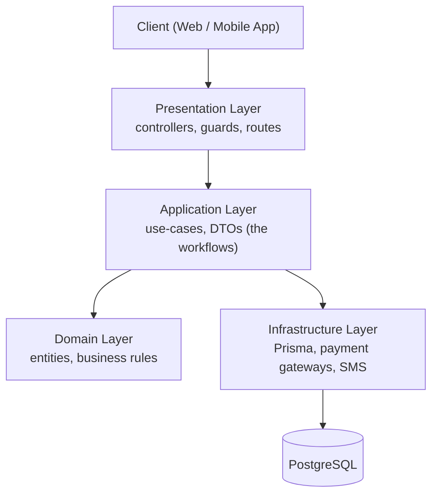
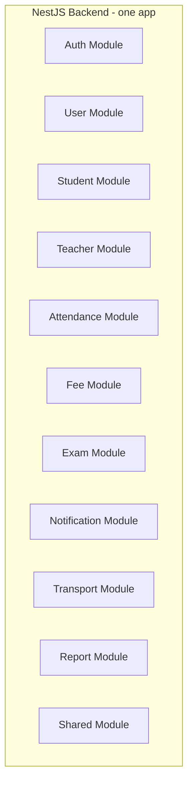
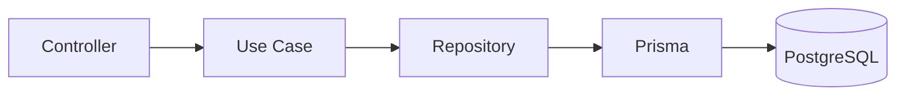
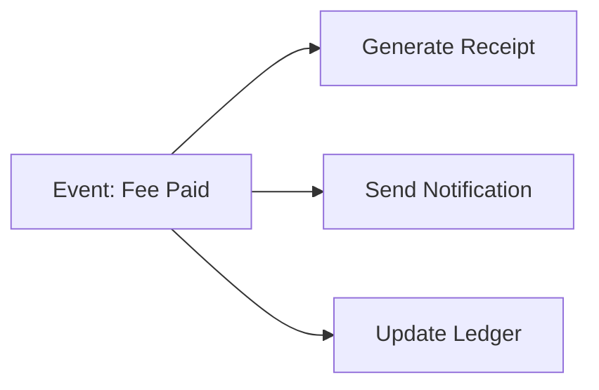
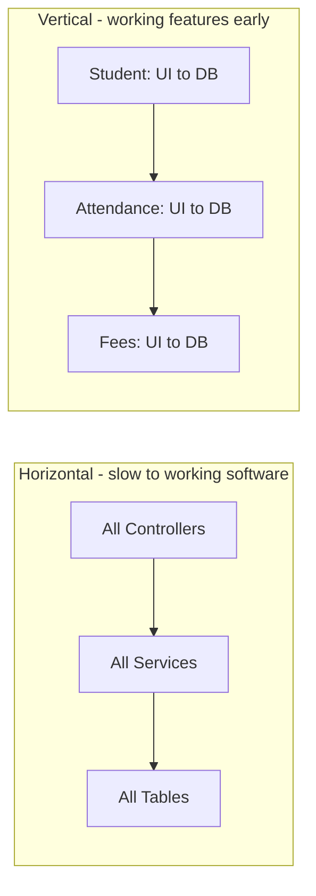
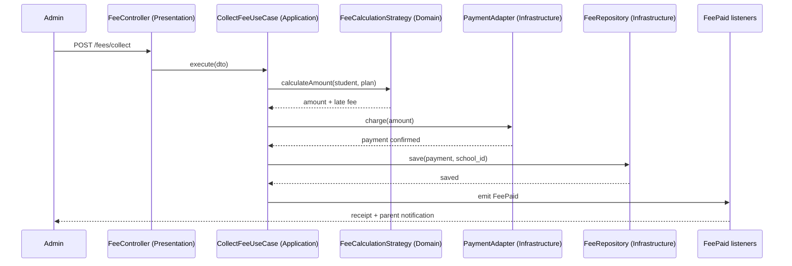

# Product Architecture

## How to read this doc

The hardest part of a school ERP is **not** picking React, NestJS, or PostgreSQL. The hard part shows up 2-3 years later, once you have dozens of modules (fees, attendance, exams, transport, notifications, hostel, library...) all tangled together. At that point, a small change in one place quietly breaks three others, and new features slow to a crawl.

This document describes a way of organizing the code so that the system stays **easy to change** as it grows from one school to a thousand. For every concept below you'll find three things:

- **What it is** - a plain-English definition.
- **Why it matters here** - the real school problem it solves.
- **Example** - a concrete case using students, fees, or attendance.

You don't have to adopt everything on day one. Treat this as the target shape the codebase grows into.

---

## The big picture

Think of the backend as four layers stacked on top of each other. A request enters at the top, travels down only as far as it needs to, and the answer travels back up. Each layer is only allowed to talk to the layer directly below it.



Plain-text view:

```
            Client (Web / Mobile App)
                      |
                      v
   Presentation Layer  (controllers, guards, routes)
                      |
                      v
   Application Layer   (use-cases, DTOs - the workflows)
                      |
            +---------+---------+
            v                   v
   Domain Layer          Infrastructure Layer
   (entities,            (Prisma, payment
    business rules)       gateways, SMS)
                                |
                                v
                          PostgreSQL
```

The golden rule: **business rules live in the middle (Domain + Application), not in the controllers and not in the database models.** Controllers just receive requests; the database just stores data. Everything that makes your school ERP *yours* lives in the middle.

---

## 1. Start with a Modular Monolith

**What it is.** A single deployable application (one codebase, one server, one database) that is internally divided into clear, self-contained modules. It is *not* microservices - you are not running ten separate services that talk over the network.

**Why it matters here.** A school ERP has lots of features but they're tightly related: collecting a fee touches the student, the ledger, and notifications. Doing that across separate microservices means network calls, distributed transactions, and a lot of pain. A modular monolith gives you clean separation *without* that operational cost - perfect for a small team moving fast.

Each box below is a module. They live in the same app but stay in their own folders with clear boundaries.



Plain-text view:

```
+---------------------- NestJS Backend (one app) ----------------------+
|                                                                      |
|  [Auth]   [User]    [Student]  [Teacher]   [Attendance]  [Fee]       |
|                                                                      |
|  [Exam]   [Notification]  [Transport]  [Report]   [Shared]           |
|                                                                      |
+----------------------------------------------------------------------+
```

**Benefits:**

- Easier deployment - one app to ship.
- Easier debugging - one place to look.
- Faster development - no cross-service plumbing.
- Single database - simple, reliable transactions.

**Later:** once a specific module has very different scaling needs (Notifications, Payments, or Reporting are common), you can extract it into its own service. Because the module was already isolated, this is a controlled move rather than a rewrite.

> Rule of thumb: start as a modular monolith. Only split out a service when you have a concrete reason (scale, isolation, separate team).

---

## 2. Clean Architecture + DDD Lite

**What it is.** A way of arranging each module into the four layers from the big-picture diagram, so business logic never leaks into controllers or database models. "DDD Lite" means we borrow the useful ideas from Domain-Driven Design (entities, value objects) without the heavy ceremony.

**Why it matters here.** Grading rules, fee calculations, and promotion logic are the heart of the product and they change often. If that logic is scattered inside controllers and Prisma calls, every change is risky. Keeping it in the domain layer makes it easy to find, test, and change.

Structure each module like this:

```
student/
├── domain/            # the "what": rules and concepts, no framework code
│   ├── entities/      # Student, with its invariants
│   ├── value-objects/ # e.g. RollNumber, AcademicYear
│   ├── repositories/  # interfaces (contracts), not implementations
│   └── services/      # domain logic spanning multiple entities
│
├── application/       # the "how": orchestrates a single workflow
│   ├── use-cases/     # CreateStudent, PromoteStudent, ...
│   └── dto/           # shapes of data in/out
│
├── infrastructure/    # the "with what": concrete tools
│   ├── prisma/        # Prisma schema + client
│   ├── repositories/  # Prisma implementation of the domain interfaces
│   └── integrations/  # 3rd-party SDKs
│
└── presentation/      # the "entry": HTTP-facing
    ├── controllers/
    └── guards/
```

The key trick: the **domain** defines a repository *interface* (a contract like "I can save a Student"), and **infrastructure** provides the Prisma implementation. The business logic depends on the contract, not on Prisma - so you could swap the database without touching your rules.

---

## 3. Design patterns that fit a school ERP

These are not academic exercises. Each one solves a recurring problem you *will* hit.

### 3.1 Repository Pattern

**What it is.** A class that wraps all database access for one entity, exposing simple methods like `create`, `findById`, `update`, `delete`. The rest of the code never touches Prisma directly.

**Why it matters here.** Database queries spread across controllers are impossible to test and impossible to change safely. Centralizing them means one place to optimize a slow student query, and easy mocking in tests.

**Bad** - controller reaches straight into the database:

```
controller --> prisma.student.findMany()
```

**Good** - each layer talks only to the next:



Plain-text view:

```
Controller --> Use Case --> Repository --> Prisma --> PostgreSQL
```

**Example:**

```
StudentRepository
    create()
    findById()
    update()
    delete()
```

### 3.2 Use Case Pattern (very important)

**What it is.** Every meaningful business operation becomes its own class with a single `execute()` method. The use case orchestrates the steps: validate, apply rules, call repositories, fire events.

**Why it matters here.** "Collect a fee" is more than one DB write - it may apply a late fee, generate a receipt, notify the parent, and update the ledger. Putting that in a named use case keeps the workflow in one readable place and out of the controller.

**Examples:**

- `CreateStudentUseCase`
- `MarkAttendanceUseCase`
- `CollectFeeUseCase`
- `GenerateReportCardUseCase`
- `PromoteStudentUseCase`

> Rule of thumb: if you can describe it as a sentence the school cares about ("promote a student"), it's a use case.

### 3.3 Factory Pattern

**What it is.** A single place that decides *which* concrete object to build based on input, so the caller doesn't need a pile of if/else branches.

**Why it matters here.** You send notifications over SMS, push, and email, and you may add WhatsApp later. A factory lets the rest of the code just say "send a notification" without caring about the channel.

**Example:**

```
NotificationFactory.create("sms")
NotificationFactory.create("push")
NotificationFactory.create("email")
```

### 3.4 Strategy Pattern

**What it is.** Define a family of interchangeable algorithms behind one interface, and pick the right one at runtime.

**Why it matters here.** Different boards and schools grade and calculate fees differently. Instead of branching everywhere, you select a strategy once.

**Examples** - grading, fee calculation, attendance rules:

```
CBSEGradingStrategy
ICSEGradingStrategy
CustomGradingStrategy
```

A school configured as CBSE gets `CBSEGradingStrategy`; the report-card code never changes.

### 3.5 Observer / Event Pattern

**What it is.** When something important happens, you emit an *event*. Other parts of the system *listen* and react, without the original code knowing who's listening.

**Why it matters here.** When a fee is paid, several unrelated things must happen. Wiring them directly into the payment code makes it bloated and fragile. Events keep each reaction independent and easy to add or remove.



Plain-text view:

```
                      +--> Generate Receipt
                      |
   Event: Fee Paid ---+--> Send Notification
                      |
                      +--> Update Ledger
```

In NestJS you can implement this with the built-in `EventEmitter`, or with richer **Domain Events** as the system matures.

### 3.6 Adapter Pattern

**What it is.** A thin wrapper that translates an external provider's API into your own consistent interface.

**Why it matters here.** Payment gateways and messaging providers change - you might start on Razorpay and add Cashfree, or switch SMS vendors. Adapters mean a provider swap touches one file, not your business logic.

**Integrations to wrap:** Razorpay, Cashfree, MSG91, WhatsApp, Firebase.

> Rule of thumb: never let a third-party SDK's types leak into your use cases. Hide them behind an adapter.

---

## 4. Multi-Tenant Database

**What it is.** One database serving many schools, where **every business table carries a `school_id` column** that scopes the row to a single school.

**Why it matters here.** You're selling to many schools from one system. If a query ever forgets to filter by school, School A could see School B's students - a serious data leak. Making `school_id` a non-negotiable on every table (and every query) is the foundation of safe multi-tenancy.

**Example tables:**

```
students                 attendance
--------                 ----------
id                       id
school_id  <-- always    school_id  <-- always
name                     student_id
class_id                 date
                         status
```

> Rule of thumb: every business table has `school_id`, and every query filters by it. Enforce it in the repository layer so no one can forget.

---

## 5. Frontend Architecture

### Feature-based structure

**What it is.** Organize the frontend by *feature* (students, attendance, fees), not by file *type* (all components in one folder, all hooks in another).

**Why it matters here.** With type-based folders, working on "fees" means hopping between `components/`, `hooks/`, `api/`, and `pages/` across hundreds of files. Feature folders keep everything for one area together, so the code is easy to find and safe to delete.

**Avoid:**

```
components/   pages/   hooks/    (hundreds of mixed files)
```

**Prefer:**

```
features/
├── students/
├── attendance/
├── exams/
├── fees/
└── transport/
```

Each feature contains its own slice of everything:

```
features/fees/
├── api/
├── components/
├── hooks/
├── types/
└── pages/
```

### State management

There are two different kinds of state, and they need different tools:

- **Server state** (data that lives in the database - student lists, fees, results): use **TanStack Query**. It handles fetching, caching, and refetching for you.
- **Client state** (purely UI state - open modals, selected filters, theme): use **Zustand**. It's small and simple.

Avoid Redux unless the team already knows and prefers it - it's usually more ceremony than this app needs.

> Rule of thumb: if the data comes from the server, it's TanStack Query's job, not a global store's.

---

## 6. CQRS Lite

**What it is.** Separate the code that **reads** data (Queries) from the code that **changes** data (Commands). "Lite" means just this separation - no event sourcing, no separate databases.

**Why it matters here.** Reads and writes have different needs. Listing students for a table is about speed and shaping data for the screen; collecting a fee is about rules and consistency. Keeping them apart keeps each one simple.

```
Queries (reads)          Commands (writes)
---------------          -----------------
GetStudents              CreateStudent
GetAttendance            MarkAttendance
                         CollectFee
```

You don't need full event sourcing - just a clear command/query split.

---

## 7. Vertical Slice Development

**What it is.** Build the product one whole feature at a time - all the way from the screen down to the database - instead of building every controller first, then every service, then every table.

**Why it matters here.** Horizontal building means nothing actually works until the very end. Vertical slices give you a *working, demoable* feature early, which is exactly what you want when showing schools progress.



Plain-text view:

```
Horizontal (slow to working software):
   All Controllers --> All Services --> All Tables

Vertical (working features early):
   Student (UI to DB) --> Attendance (UI to DB) --> Fees (UI to DB)
```

**Example:** finish the Student module end-to-end (Create, Get, Update, Delete - UI through database) before starting Attendance.

> Rule of thumb: a finished vertical slice is something you could ship today.

---

## 8. Testing Strategy

Test at three levels, each for what it's best at:

- **Unit tests** - the business brain, in isolation: use cases, fee calculations, grading logic, attendance rules. Fast and numerous.
- **Integration tests** - the parts that touch the database: repositories, queries, API endpoints. Confirms the pieces work together.
- **End-to-end (E2E) tests** - the critical journeys a school can't tolerate breaking: admission, fee payment, attendance, report card.

**Tools:** Vitest (unit + integration), Playwright (E2E).

> Rule of thumb: lots of fast unit tests for logic, a focused set of E2E tests for the money-and-trust flows.

---

## 9. End-to-end walkthrough: "Collect a fee"

This ties every concept together. Here's what happens when an admin records a fee payment, layer by layer:

1. **Presentation** - the `FeeController` receives the request and a guard checks the user's role and school.
2. **Application** - `CollectFeeUseCase.execute()` runs the workflow.
3. **Domain** - a `FeeCalculationStrategy` applies the right rules (e.g. CBSE late fee).
4. **Infrastructure** - a payment **adapter** (Razorpay/Cashfree) processes the charge; the `FeeRepository` saves the record (scoped by `school_id`).
5. **Event** - a `FeePaid` event fires; listeners generate the receipt, notify the parent (via the notification **factory**), and update the ledger - independently.



Plain-text view:

```
Admin
  | POST /fees/collect
  v
FeeController (Presentation)
  | execute(dto)
  v
CollectFeeUseCase (Application)
  | calculateAmount(student, plan)
  v
FeeCalculationStrategy (Domain) --> returns amount + late fee
  | charge(amount)
  v
PaymentAdapter (Infrastructure) --> payment confirmed
  | save(payment, school_id)
  v
FeeRepository (Infrastructure) --> saved
  | emit FeePaid
  v
FeePaid listeners --> receipt + parent notification --> Admin
```

Notice how each pattern did exactly one job, and nothing reached across boundaries. That's what keeps the system changeable.

---

## 10. The Tech Lead blueprint

If I were leading this build, here's the target shape:

| Area | Choices |
| --- | --- |
| **Frontend** | Next.js, TypeScript, TanStack Query, Zustand, feature-based structure |
| **Backend** | NestJS, Clean Architecture, DDD Lite, Repository Pattern, Use Cases, CQRS Lite, event-driven internally |
| **Database** | PostgreSQL, Prisma, multi-tenant (`school_id` everywhere) |
| **Infrastructure** | Docker, Redis, AWS S3 / Cloudflare R2, FCM, Razorpay |
| **Development** | Vertical slice development, feature flags, CI/CD, automated testing |

Put together, this gives you a codebase that can comfortably grow from **1 school to 1000+ schools** without requiring a rewrite.
