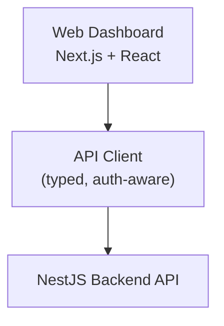
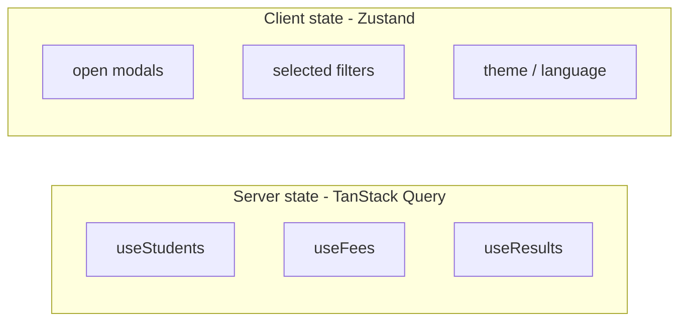
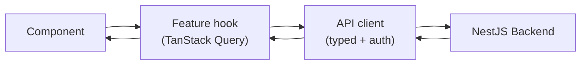

# Web Architecture

## How to read this doc

This document describes how the **web app** of the school ERP is organized - the admin/management/teacher dashboard, where most data entry and reporting happens. For every concept you'll find three things:

- **What it is** - a plain-English definition.
- **Why it matters here** - the real school problem it solves.
- **Example** - a concrete case using students, fees, or attendance.

For the parent/student mobile app see [mobile-architecture.md](mobile-architecture.md), and for the server side (NestJS, database, patterns) see [backend-architecture.md](backend-architecture.md).

---

## The big picture

The web app is a feature-organized React/Next.js application. It keeps **server data** and **UI state** in separate tools, and never talks to the database directly - it goes through the backend API.



Plain-text view:

```
   Web Dashboard (Next.js + React)
                |
                v
   API Client (typed, auth-aware)
                |
                v
        NestJS Backend API
```

---

## 1. Tech stack

- **React** - component model.
- **Next.js** - routing, server rendering, great admin-dashboard experience, SEO for the public site.
- **TypeScript** - types shared in spirit with the backend's DTOs.
- **Tailwind CSS** - fast, consistent styling.
- **shadcn/ui** - accessible component primitives you own and can customize.

**Why this fits a school ERP.** The admin dashboard is large and form-heavy (admissions, fee structures, marks entry). Next.js plus shadcn/ui gets you a polished, consistent UI quickly, and Tailwind keeps styling predictable across dozens of screens.

---

## 2. Feature-based structure

**What it is.** Organize the app by *feature* (students, attendance, fees), not by file *type* (all components in one folder, all hooks in another).

**Why it matters here.** With type-based folders, working on "fees" means hopping between `components/`, `hooks/`, `api/`, and `pages/` across hundreds of files. Feature folders keep everything for one area together, so the code is easy to find and safe to delete.

**Avoid:**

```
components/   pages/   hooks/    (hundreds of mixed files)
```

**Prefer:**

```
features/
├── students/
├── attendance/
├── exams/
├── fees/
└── transport/
```

Each feature contains its own slice of everything:

```
features/fees/
├── api/          # calls to the backend (collect fee, list dues)
├── components/   # FeeTable, CollectFeeDialog, ...
├── hooks/        # useFees, useCollectFee (wrap TanStack Query)
├── types/        # Fee, FeePlan, Receipt
└── pages/        # screen-level composition
```

> Rule of thumb: if you're adding a screen for "fees", everything you touch should live under `features/fees/`.

### Shared layer

Anything used by more than one feature lives in a shared area, not copied around:

```
shared/
├── ui/        # design-system wrappers around shadcn/ui (Button, Table, Dialog)
├── lib/       # api client, date/money formatting, validation helpers
├── hooks/     # cross-cutting hooks (useAuth, useSchoolContext)
└── types/     # shared types (Role, Pagination)
```

---

## 3. State management

There are two different kinds of state, and they need different tools:

- **Server state** (data that lives in the database - student lists, fees, results): use **TanStack Query**. It handles fetching, caching, and refetching for you.
- **Client state** (purely UI state - open modals, selected filters, theme): use **Zustand**. It's small and simple.

Avoid Redux unless the team already knows and prefers it - it's usually more ceremony than this app needs.



Plain-text view:

```
Server state (TanStack Query)     Client state (Zustand)
-----------------------------     ----------------------
useStudents                       open modals
useFees                           selected filters
useResults                        theme / language
```

> Rule of thumb: if the data comes from the server, it's TanStack Query's job, not a global store's.

---

## 4. Data flow

A screen never calls the backend directly. It uses a feature hook, which uses the typed API client.



Plain-text view:

```
Component --> Feature hook (TanStack Query) --> API client (typed + auth) --> NestJS Backend
   ^                                                                              |
   +------------------------------------------------------------------------------+
```

**Example - collecting a fee:**

1. `CollectFeeDialog` (component) calls `useCollectFee()` (hook).
2. `useCollectFee` is a TanStack Query *mutation* that calls `feesApi.collect(dto)`.
3. `feesApi.collect` uses the shared API client, which attaches the auth token and school context.
4. On success, the hook invalidates the `["fees", schoolId]` query so the table refreshes automatically.

---

## 5. Routing and auth

- **Routing.** Next.js file-based routes. Group routes by role (admin area, teacher area) so navigation and access checks stay simple.
- **Tokens.** The backend issues a JWT **access token** and a **refresh token**. The API client stores them (http-only cookie or secure storage), attaches the access token to every request, and silently refreshes when it expires.
- **Route guards.** A small `useAuth` hook gates protected routes and redirects unauthenticated users to login. UI also hides actions the user's role can't perform - but the backend remains the real authority on permissions.

---

## 6. Multi-tenant awareness

The backend scopes every record by `school_id`. The web app mirrors this with a **school context**:

- After login, the current user's school (or selected school, for multi-school admins) is held in a `useSchoolContext` store.
- The API client includes that school context on requests, and TanStack Query keys include the school id (e.g. `["students", schoolId]`) so cached data never bleeds between schools.

> Rule of thumb: any cached server data is keyed by school, so switching schools can never show stale data from another tenant.

---

## 7. Testing

- **Unit / component tests** - **Vitest** (with Testing Library) for components, hooks, and formatting helpers.
- **End-to-end (E2E) tests** - **Playwright** for the critical journeys a school can't tolerate breaking: login, admission form, fee payment, viewing results.

> Rule of thumb: lots of fast component tests, a focused set of E2E tests for the money-and-trust flows.

---

## Web blueprint

| Area | Choices |
| --- | --- |
| **Framework** | Next.js, React, TypeScript |
| **Styling** | Tailwind CSS, shadcn/ui |
| **Server state** | TanStack Query |
| **Client state** | Zustand |
| **Structure** | Feature-based folders + shared layer |
| **Auth** | JWT access + refresh, role-based route guards |
| **Testing** | Vitest (unit/component), Playwright (E2E) |

For the mobile client see [mobile-architecture.md](mobile-architecture.md); for the matching server design see [backend-architecture.md](backend-architecture.md).
